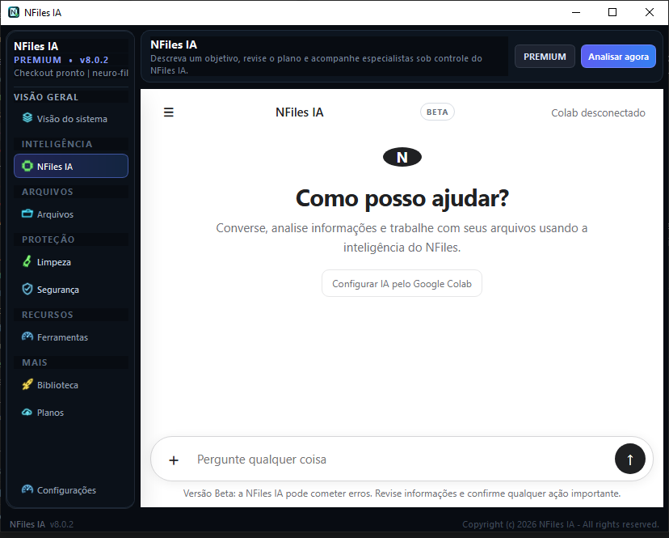
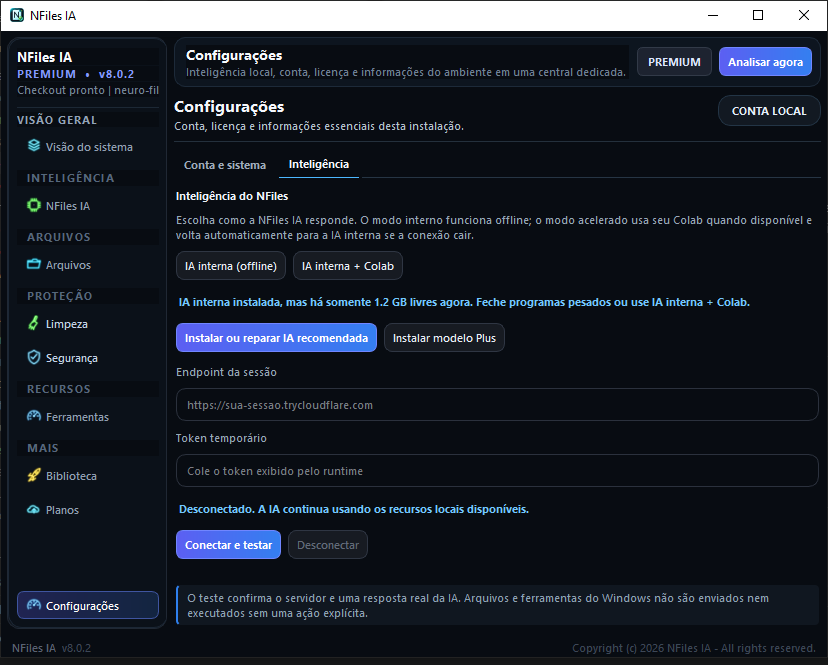
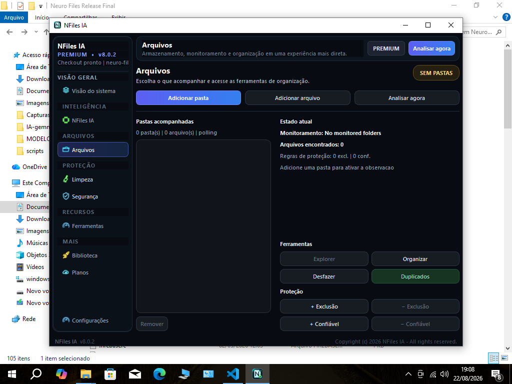
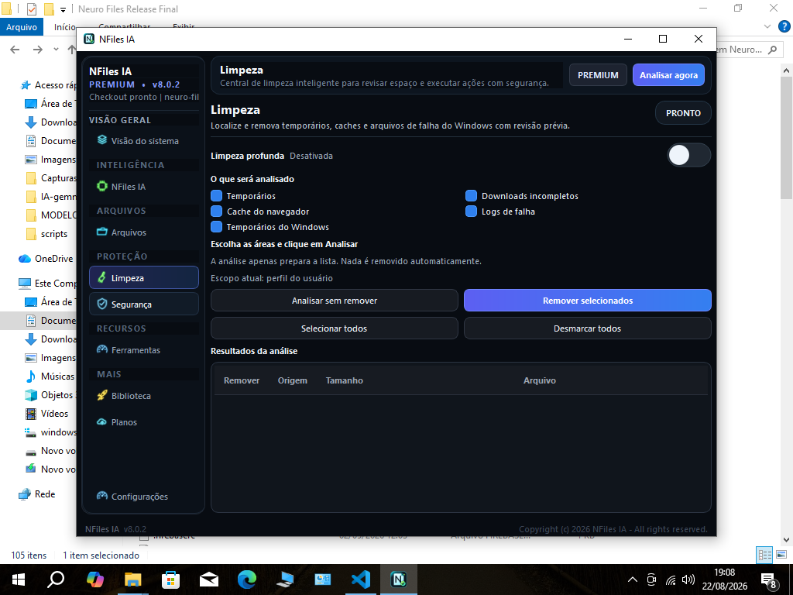
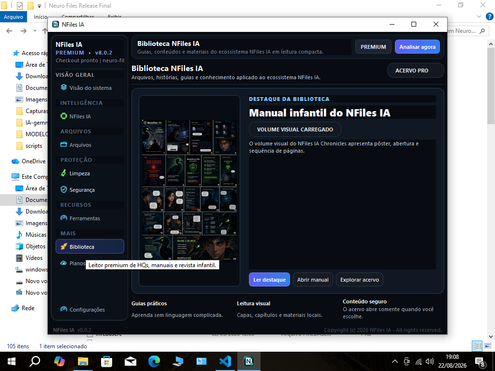

# NFiles IA

  <strong>Seu espaço digital, organizado com inteligência.</strong> 
  Organização, limpeza, documentos e proteção em uma experiência feita para Windows.

  
  
  
  

> Este é o canal público oficial de atualizações, downloads, documentação e suporte do NFiles IA. O código-fonte principal permanece privado durante o Beta.

  <a href="https://github.com/neurofiles1982-hub/NFiles-IA-Update/releases/tag/v8.0.2"><strong>⬇ Baixar a versão Beta</strong></a>
  &nbsp;·&nbsp;
  <a href="https://github.com/neurofiles1982-hub/NFiles-IA-Update/issues/new/choose"><strong>Enviar feedback</strong></a>

## Tudo em um só lugar

| Organização | Manutenção | Inteligência |
|---|---|---|
| Explore e organize arquivos | Encontre espaço recuperável | Converse com a IA do NFiles |
| Revise duplicados com segurança | Analise riscos e quarentena | Leia documentos e use anexos |
| Pesquise grandes coleções | Controle o uso de recursos | Use IA local ou Google Colab |

O NFiles IA adapta o processamento ao computador. Em máquinas com menos memória, o usuário pode manter os recursos locais e conectar uma sessão própria do Google Colab para acelerar a IA.

## Uma história construída com persistência

O NFiles IA nasceu em um computador modesto e foi desenvolvido por uma única pessoa ao longo de mais de um ano. Seu criador começou a aprender programação em 1994 e continuou próximo da tecnologia desde então, transformando décadas de curiosidade em um produto voltado a problemas reais do dia a dia.

Essa origem definiu uma regra do projeto: inteligência só é útil quando respeita o computador de quem a utiliza. Por isso, o NFiles IA foi desenhado para dividir tarefas em etapas, limitar paralelismo, processar grandes coleções progressivamente e adaptar a IA à memória disponível. Quando o hardware local não é suficiente, a conexão opcional com uma sessão Colab do próprio usuário oferece um caminho adicional sem retirar as ferramentas nativas do aplicativo.

Não é apenas uma tela de conversa. A IA acompanha um conjunto de ferramentas que pode ajudar a organizar arquivos, localizar espaço recuperável, revisar duplicados, ler documentos e verificar sinais de risco — sempre com limites de recursos e confirmação antes de ações importantes.

## Interface moderna e direta

  

- Chat acessível com histórico, anexos e respostas na própria tela.
- Ferramentas separadas por objetivo, sem excesso de telas repetidas.
- Operações importantes supervisionadas e confirmadas pelo usuário.
- Processamento local sempre que o recurso estiver disponível.

## Conheça o NFiles IA

### Arquivos e organização

Pastas e arquivos acompanhados em uma área dedicada, com acesso às ações de organização, duplicados, proteção e desfazer.

### Limpeza com revisão

A análise prepara resultados para revisão. Nada é removido apenas porque uma verificação foi iniciada.

### Biblioteca integrada

Guias, materiais visuais e conteúdos do ecossistema ficam disponíveis sem misturar a navegação principal com operações do computador.

## Download e atualizações

As versões oficiais são publicadas em [Releases](../../releases). Cada pacote deve acompanhar hash SHA-256 e notas da versão.

> Ainda não há uma versão estável. Durante o Beta, não baixe instaladores enviados por terceiros e nunca compartilhe tokens do Colab em Issues.

## Suporte público

Issues estão abertas para todas as pessoas com uma conta GitHub:

- [Relatar um problema](../../issues/new?template=bug_report.yml)
- [Sugerir uma melhoria](../../issues/new?template=feature_request.yml)
- [Acompanhar problemas conhecidos](../../issues)

Ao relatar um erro, remova nomes de usuário, caminhos pessoais, tokens, chaves e documentos privados das capturas de tela.

## Roadmap do Beta

- Compreensão de imagens e OCR;
- imagem para texto e geração supervisionada;
- transcrição e respostas por voz;
- assistência de código e revisão contextual.

As datas são metas de desenvolvimento, não promessa de entrega. Cada capacidade será liberada somente após testes de segurança, qualidade e desempenho.

## Segurança e transparência

- Ações destrutivas exigem confirmação explícita.
- Respostas de IA podem conter erros e devem ser revisadas.
- Tokens e credenciais nunca devem ser publicados.
- Modelos e componentes são distribuídos separadamente, com versão e integridade verificáveis.

Para contato privado: `neurofilesaipro@hotmail.com`.

---

© 2026 NFiles IA · Canal público oficial

